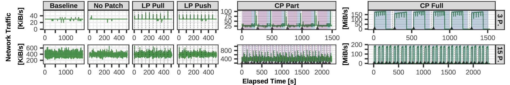
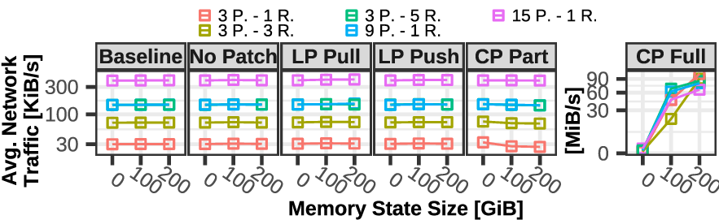
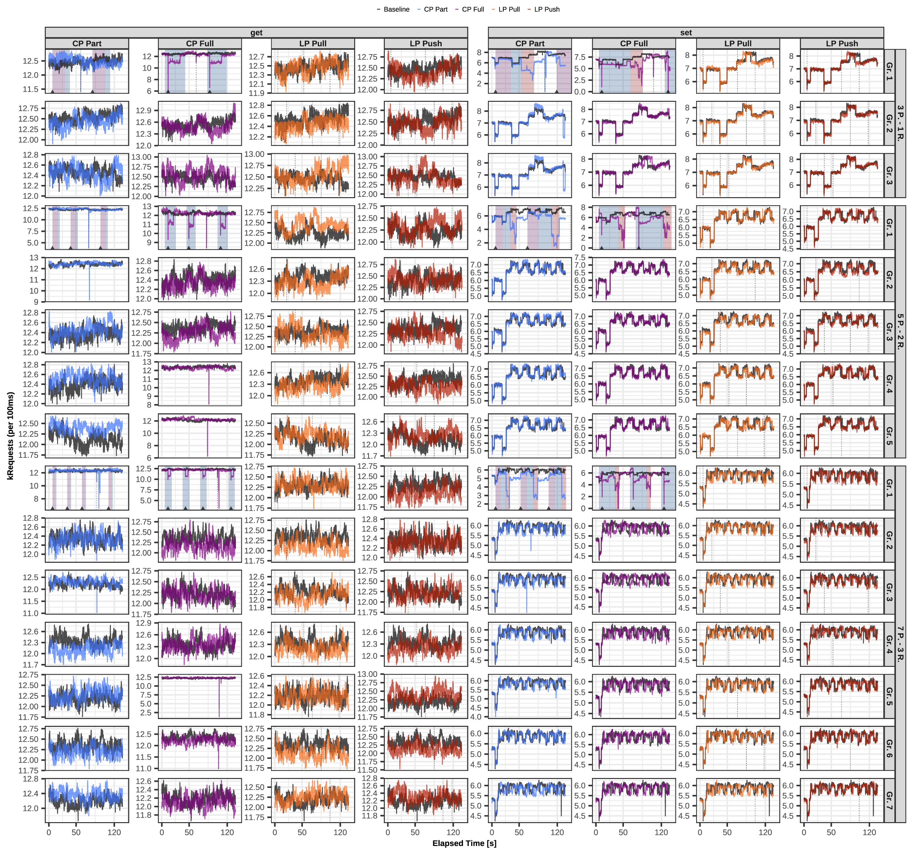
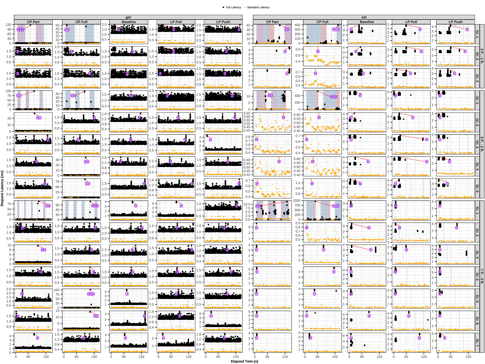

# Live Patching for Distributed In-Memory Key-Value Stores - Reproduction Package

[-10.5281%2Fzenodo.13729902-blue)](https://doi.org/10.5281/zenodo.13729902)
[-10.5281%2Fzenodo.13765240-blue)](https://doi.org/10.5281/zenodo.13765240)

This repository hosts the additional materials accompanying the SIGMOD 2025 paper titled ***Live Patching for Distributed In-Memory Key-Value Stores***. The original experiment data is available on Zenodo: https://doi.org/10.5281/zenodo.13729902. Additionally, a QEMU virtual machine configured to reproduce our experiments is also hosted on Zenodo: https://doi.org/10.5281/zenodo.13765240. Please note that the data and VM are provided as separate Zenodo uploads due to the maximum file size limitations.

- [Reproduction](#reproduction)
  - [Server](#server)
- [Original Data](#original-data)
  - [raw vs. transformed data](#raw-vs-transformed-data)
- [WfPatch Extension](#wfpatch-extension)
- [Directory Overview](#directory-overview)
- [Referenced from the Paper](#referenced-from-the-paper)
  - [Network Overhead](#network-overhead)
  - [Reducing Noise](#reducing-noise)
  - [Plots](#plots)

## Reproduction

Please see the [reproduction](reproduction) directory for all steps on how to reproduce this research. **Before performing the reproduction, please see the "Server" section below, as a modified Linux kernel is required for the experiments.**

### Server

To reproduce our study, you will need a modified Linux kernel, which is available at [https://github.com/luhsra/linux-mmview](https://github.com/luhsra/linux-mmview) (commit hash: `ecfcf9142ada6047b07643e9fa2afe439b69a5f0`).

For convenience, we provide a pre-configured QEMU virtual machine that can be used to replicate our experiments. **However, please note that running the experiments inside a VM may introduce overhead that could affect the results. Therefore, we recommend conducting the experiments directly on a server for more accurate reproduction of our findings.**

Detailed instructions for setting up QEMU and notes about how to prepare your server for reproduction are available in the [server](server) directory.

## Original Data

We provide our results in Zenodo: https://doi.org/10.5281/zenodo.13729902

- Raw experiment data (232 GB unpacked):
  - `./download-raw-data`
- Transformed experiment data (82 GB unpacked):
  - `./download-transformed-data`

> **_NOTE:_** When using one of the download- scripts, the data is downloaded, extracted and the downloaded archive gets deleted.

### raw vs. transformed data

The raw data from most experiments is transformed into a DuckDB database, which is then used for all subsequent analysis and plotting. However, some experiment data is directly used for analysis and plotting without being converted into a DuckDB database. All data used for analysis and plotting is included in the "transformed" data.

The "raw" data includes the original data from which the DuckDB databases were created and is provided for reference.

## WfPatch Extension

Please refer to the [wfpatch-extension](wfpatch-extension) directory for a detailed overview of our extensions to the WfPatch user-space library. Our work builds on a previously modified version of the library that we developed [1]. In this directory, we outline the changes made in comparison to our earlier version [1] and, for completeness, also provide a comparison with the version by Rommel et al. [2].

[1] Michael Fruth and Stefanie Scherzinger. 2024.
The Case for DBMS Live Patching. In Proc. VLDB Endow. 17. Reproduction Package: https://github.com/sdbs-uni-p/vldb25-dbms-live-patching

[2] Florian Rommel, Christian Dietrich, Daniel Friesel, Marcel Köppen, ChristophBorchert, Michael Müller, Olaf Spinczyk, and Daniel Lohmann. 2020. From Global to Local Quiescence: Wait-Free Code Patching of Multi-Threaded Processes. In Proc. OSDI. 651–666.

## Directory Overview

- [image](images)
  - Plots referenced in this README.
- [server](server)
  - Location for the QEMU VM and instructions for preparing your own server.
- [reproduction](reproduction)
  - Scripts to reproduce our research.
- [wfpatch-extension](wfpatch-extension)
  - Highlights our extensions to the WfPatch user space library.

## Referenced from the Paper

This chapter contains all the materials and descriptions referenced in the paper.

### Reducing Noise

In detail, we performed the following (system) optimizations to reduce noise during measurements:

1. Intel Turbo Boost is disabled.
2. All CPU cores are fixed to a core frequency of 3.0 GHz.
3. Intel Hyper-Threading is disabled.
4. We use CPU pinning to isolate the Redis Cluster from the benchmark framework. All nodes of the Redis Cluster are assigned to all 24 cores of CPU 1. The benchmark framework is assigned to 23 cores of CPU 0 (we skip core 0 to leave it to the OS). Both the cluster and the benchmark framework benefit from ample hardware cores, enabling the scheduling of each thread or cluster node (in case the cluster comprises fewer than 25 nodes) on its dedicated hardware CPU core (but we leave scheduling to Linux).
5. To avoid noise from the `fork` system call, we disabled persistency (snapshotting and logging) of a Redis node.
6. We disabled the option that replicas can migrate between master nodes, i.e. we always have the same nodes operating as a master-replica group.
7. To avoid [endless replication loops](https://redis.io/blog/top-redis-headaches-for-devops-replication-buffer/), we do not enforce a limit on the replication buffer.
8. For experiments using partial resynchronization, we set the replication backlog size of the master to 30 GiB (default is 1 MiB) until the replica is fully operational after a restart. This practice ensures that a replica node can effectively execute a partial resynchronization, receiving only the missed commands from the master.
9. The integration of our live patching process into the cronjob can distort measurements, particularly with pull-based distribution. To showcase, we just assume that a random node is pinged every second (without the fact that other PING/PONG packets are sent/received). Specifically, this occurs consistently at time X.0. For example, the patch is applied consistently at time X.1. This results in a delay of 0.9 seconds before the patch is sent to another node with the next PING packet. This delay can introduce bias in our experiments, especially when measuring the time from applying a patch until the patch is distributed in the entire cluster. To mitigate this effect, we apply each patch with a random offset of up to &plusmn; 0.5 seconds.

### Network Overhead
> **_NOTE:_** The following section complements Section 6.7 (Experiments > Network Overhead) of the paper.

**Setup.**
To precisely measure the network traffic of each node, we record all its sent bytes (we extended the source code accordingly).

In addition to the runs in which we apply a live patch (as we have done in the other experiments), we now conduct a baseline run with no patches applied using the prototype binary. This "No Patch" run reduces noise, so that we can faithfully capture the actual network overhead caused by piggybacking on the gossip protocol.

In the experiment, we preload the cluster with 200 GiB. For conventional patching, we patch the entire cluster once. For live patching, we apply 10 synthetic patches with a 50-second delay between each. We do not execute a benchmark to measure only network traffic between nodes and to avoid the influence of client requests.

#### Network Over Time
Network traffic over time, aggregated in 1 second time slots for cluster sizes 3 P. - 1 R. (row "3 P.") and 15 P. - 1 R. (row "15 P."). Data resynchronization in conventional patching drives network costs up to the MiB range (vs. KiB).

The figure shows the network traffic over time, where we aggregate all network data sent in 1 second intervals.
Note that the time frames on the horizontal axes differ between experiments and that, for full resynchronization, the unit of measurement on the vertical axis is in MiB/s instead of KiB/s.
The rows in the figure represent the cluster size, where the first row labeled "3 P." corresponds to a cluster size of 3 P. - 1 R., and the second row labeled "15 P." to a cluster size of 15 P. - 1 R.

For patching actions, we use the same visual means as in the paper.
A dashed line indicates the triggering of an action (failover/live patch), a colored background indicates the restarting and resynchronization of a node. A triangle indicates the creation of a snapshot.

**Result.**
For the runs "Baseline" and "No Patch", the 3 P. - 1 R. cluster sends a nearly constant 30 KiB per second. The overhead of our extension to the gossip protocol, which adds a mere 4 B to the cluster packets, is negligible and does not result in any noticeable overhead (column "No Patch"). For the larger cluster (15 P. - 1 R.) network traffic fluctuates between 200 KiB and 600 KiB per second.

*Conventional Patching.*
For partial resynchronization, once the snapshot was restored, the replica communicates with the master about commands missed while offline. As no benchmark was performed, the data was not modified. However, we observe a short increase, from about 25 KiB to 100 KiB at the end of the replica node resynchronization process (blue background). The advantage of transferring only changed data comes at the costs of I/O: For the memory state of 200 GiB, a total of about 150 GiB are written and read from disk (reduced by about 25% due to built-in compression).

For full resynchronization, a replica node restores its state on restart by obtaining a snapshot from the master node. The costs for transmitting this snapshot are apparent in spikes of approximately 200 MiB/s during a node restart. This effect is observable for each individual replica node. It is important to recall that all nodes run on the same machine, thus we make use of the loopback interface for network communication. Our loopback interface demonstrates a transfer capacity of about 35 GiB/s (verified via iperf), indicating that the 200 MiB/s rate is restricted by data processing (e.g. restoring data from the snapshot) rather than network transfer.

*Live Patching.*
With live patching, we observe an increase in network activity for a timeframe of about 2 seconds for the 3 P. - 1 R. cluster size when applying a patch, at a mere rate of approx. 45 KiB per second. This timeframe aligns with a median update lag of about 1.5 seconds (see Section 6.4 in the article) and the increase occurs due to the additional exchange of patch requests and patch packets.
In the larger 15 P. - 1 R. cluster, these mini spikes are not even discernible among the higher traffic.

#### Overall Network
For conventional patching using full resync. (CP Full), the size of the memory state impacts network traffic.}

For a more comprehensive overview of the network traffic sent, the figure shows the average network traffic with varying parameters. Network traffic is normalized by the duration of each experiment. Note that, for full synchronization, the unit of measurement is again MiB/s instead of KiB/s.

**Result.**
The baseline runs show that network traffic increases with the size of the cluster.
The costs depend on the total number of nodes and not their role:
The near-identical traffic of clusters 3 P. - 5 R. and 9 P. - 1 R., each totaling 18 nodes, causes overplotting.

*Conventional Patching.*
As no data is modified during node shutdown, the total network traffic for partial resynchronization is de-facto identical to the baseline run.
For full resynchronization (on the right), network traffic clearly increases with the amount of preloaded data. Obviously, the more data is stored, the more must be synchronized over the network.

*Live Patching.*
The figure confirms
that for live patching, the network costs are independent of the memory state. In general, the network overhead introduced by live patching (our extension to the communication protocol and patch distribution) is negligible.

#### Summary
Overall, **the network overhead for live patching is marginal**. In this regard, live patching is superior over conventional patching, where we observe significant increases in network overhead, particularly for larger memory states and full resynchronization. Additionally, partial resynchronization causes less network traffic compared to full resynchronization, but at the costs of additional disk I/O for saving and restoring a snapshot.

---

### Plots

This section contains additional plots which we have referred to in the paper.

#### Throughput

The bar charts show the total throughput (as requests per second). The charts do not reveal performance regressions since they smooth out local performance degradation.

#### Throughput Over Time - All Master-Replica Groups

This chart is a supplement to Figure 9 in the paper. All master replica groups are displayed for all parameters.

#### Tail Latencies - All Master-Replica Groups

This chart is a supplement to Figure 10 in the paper. All master replica groups are displayed for all parameters.

#### Network Traffic over Time - All Master-Replica Groups

This chart is a supplement to the Network Overhead section above. All master replica groups are displayed for all parameters. The rows (0, 100, 200) define the memory state in GiB.

